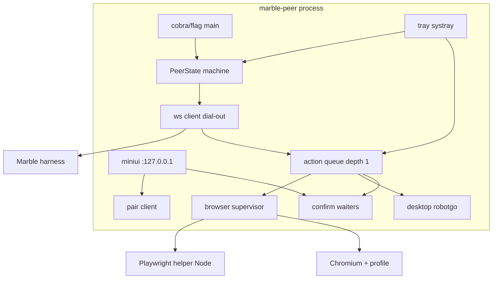

# ADR-0021: marble-desktop-peer — Desktop Agent Implementation

| Field | Value |
|-------|--------|
| **Status** | Accepted (ready to implement) |
| **Date** | 2026-07-27 |
| **Author** | — |
| **Deciders** | Project owner |
| **Tags** | marble-desktop-peer, peer, robotgo, playwright, CDP, tray, autostart, packaging, security |
| **Extends** | [ADR-0020](0020-marble-peer.md) (system design, harness contract, locked Q1–Q10) |
| **Repo** | **`github.com/rendicott/marble-desktop-peer`** (binary **`marble-peer`**) |
| **Answers** | `adr/0021-answers.json` (`2026-07-27T03:20:46.838Z`) |
| **Doc home** | Marble monorepo `adr/0021` is system pointer; **canonical peer copy** = peer repo `adr/0001-desktop-agent.md` once repo exists (**Q_P10**) |

## Overview

[ADR-0020](0020-marble-peer.md) defines the **system**: Marble harness is the brain; a separate peer binary is the hands; mutual pairing; Playwright + robotgo; tools and Settings live in the harness.

**Most of the engineering risk is on the peer.** This ADR is the **implementation design for `marble-desktop-peer` only**: process model, state machine, browser lifecycle, desktop I/O, tray/mini-UI, credential storage, OS packaging, action queue, and failure modes.

Harness-side schema/API/tools remain ADR-0020 + future harness PRs (M1–M6). This document is what peer P0–P5 implement.

```text
                    ADR-0020 (system + contract)
                           │
           ┌───────────────┴───────────────┐
           ▼                               ▼
   marble monorepo                   THIS ADR (0021)
   pairing hub, tools                marble-desktop-peer
   Settings, SQLite                  process, OS, browser, desktop
```

## Background — why a peer-only ADR

| Complexity | Lives in peer | Hard parts |
|------------|---------------|------------|
| CGO / robotgo / Wayland | ✓ | Build matrix, DPI, permissions |
| Playwright / Node / CDP profile | ✓ | Launch, attach, profile path, crashes |
| System tray | ✓ | 3 OS APIs, no full GUI |
| Autostart | ✓ | Login items / LaunchAgent / user systemd |
| Device credential at rest | ✓ | Keychain / DPAPI / file 0600 |
| Action serialize + cancel | ✓ | Single flight, Stop from tray + wire |
| Mini UI on localhost | ✓ | Pair + confirm without native windows |
| Release signing / notarize | ✓ | Especially macOS |

Harness complexity is real but mostly **CRUD + WS hub + tool proxy** — smaller than making “click my DoorDash” reliable on three desktops.

## Goals & Non-Goals

### Goals

1. **Single long-running process** (`marble-peer run` / autostart) that owns tray, WS client, action queue, browser helper, and desktop driver.  
2. **Faithful client of ADR-0020 protocol** (`peer_protocol_version`, mutual pair, dial-out WS).  
3. **Browser path** (Playwright MCP/helper + dedicated profile) reliable enough for daily logged-in use.  
4. **Desktop path** (robotgo) as fallback; primary display; safe defaults.  
5. **Operator can always regain control:** tray Stop, confirm timeouts, Quit, unpair.  
6. **Ship multi-arch binaries** with clear install docs (Node dependency called out).  
7. **No secrets leave the machine** except protocol-required device auth material (token/pubkey attestations) — never cookies, never passwords.

### Non-goals (v1)

| Non-goal | Notes |
|----------|-------|
| Implementing harness SQLite / `computer_*` tools | ADR-0020 / marble repo |
| Multi-monitor, cron drives, cookie export | Locked out in ADR-0020 |
| Full native GUI / Electron shell | Tray + mini HTTP only |
| Headless server-only peer (no user session) | Needs login seat |
| Perfect Wayland input day one | Document X11 / XWayland; browser path still works |

## Key Decisions (peer)

| # | Decision | Rationale |
|---|----------|-----------|
| **PKD1** | **One process** for tray + daemon + miniui + WS (not separate tray helper + agent unless OS forces it) | Simpler lifecycle; single Stop kills actions |
| **PKD2** | **State machine** for peer lifecycle (see below); all subsystems observe `PeerState` | Avoid “tray green but browser dead” without signal |
| **PKD3** | **Action executor is a single worker** (queue depth 1 per ADR-0020 Q7); cancel via context | Matches harness serialization |
| **PKD4** | **Browser supervisor** owns Playwright helper + **system** Chrome/Edge/Chromium (**Q_P7**) with dedicated profile; restart with backoff. On peer Quit: **leave browser running** by default; `--kill-browser-on-exit` opt-in (**Q_P1**) | Crash isolation; preserve tabs/logins on Quit |
| **PKD5** | **Profile root** under peer data dir: `$MARBLE_PEER_HOME/chrome-profile` (default `~/.marble-peer`) | ADR-0020 Q2 dedicated profile |
| **PKD6** | **Desktop ops** only through `internal/desktop` wrapping robotgo; never call robotgo from browser package. **`computer_screenshot`** = **full primary desktop** (**Q_P3**) | Clear layering; vision of whole screen for computer use |
| **PKD7** | **Config** `config.json`; **secrets** in **OS keychain when available, else `credentials` mode 0600** (**Q_P4**); `status` reports which store | Balance security vs debug |
| **PKD8** | **Mini UI** `127.0.0.1` only by default. Port: **18765**, else **18766–18775**, else random; write chosen port to state file (**Q_P8**) | Avoid WAN exposure; survive conflicts |
| **PKD9** | **Logs** to `$MARBLE_PEER_HOME/logs/peer.log` with rotation; never log cookies/HTML. **No telemetry v1** (**Q_P9**) | Privacy |
| **PKD10** | **Build tags / CGO**: document robotgo deps; CI builds three targets. **Portable binary + optional `install-autostart`**; no system packages v1 (**Q_P6**) | Simple install |
| **PKD11** | Protocol **client only** from marble OpenAPI/JSON | ADR-0020 Q10 |
| **PKD12** | **Confirm** mini-UI + tray; default deny **120s** (ADR-0020 Q3) | Money/auth gate |
| **PKD13** | **Action deadline:** default **120s**; peer hard **max 5 min** per act; harness may request up to that max and **retry** longer workflows as multiple acts (**Q_P5**) | Bounded hangs; long jobs via multi-step |
| **PKD14** | **Node/Playwright packaging (**Q_P2**):** Prefer **no system Node pre-install** — spike embedding or side-by-side helper in release if size stays reasonable. If packaging is too hard or artifacts **unwieldy**, fall back to **document system Node** dependency. | Owner priority: zero Node friction when practical |
| **PKD15** | After peer repo exists: **copy this ADR to peer `adr/0001`**; marble **0021 remains pointer + system context** (**Q_P10**) | Dual home without fork drift |

## Process architecture



### PeerState (normative)

| State | Meaning | Tray color (rec) |
|-------|---------|------------------|
| `Unpaired` | No device credential | Gray |
| `Pairing` | Mutual handshake in progress | Yellow |
| `Offline` | Paired but WS down | Red |
| `Online` | WS up, ready for actions | Green |
| `Degraded` | WS up but browser and/or desktop unavailable | Yellow |
| `Busy` | Action in flight | Green + busy badge/menu label |
| `AwaitingConfirm` | Blocked on user confirm | Yellow pulse |
| `Stopping` | Cancel + shutdown | Gray |

Transitions are single-threaded via a small event loop or mutex + cond.

### CLI surface

```text
marble-peer run                 # foreground daemon + tray (default entry for autostart)
marble-peer pair --harness URL --code H-XXXXXX
marble-peer pair --serve        # mini UI pair flow only (or full miniui)
marble-peer status              # print state, caps, last error (JSON optional)
marble-peer unpair              # wipe local credential; leave process or exit
marble-peer install-autostart
marble-peer uninstall-autostart
marble-peer version
```

`run` is the only long-lived mode. Autostart invokes `marble-peer run` (or `run --quiet`).

## Data directory layout

```text
$MARBLE_PEER_HOME/                    # default ~/.marble-peer  (override env)
├── config.json                       # harness_url, log_level, browser prefs
├── credentials                       # or keychain ref; mode 0600
├── device_id                         # stable UUID
├── chrome-profile/                   # dedicated Chromium user-data-dir
├── logs/
│   └── peer.log
└── state.json                        # optional crash recovery hints (not secrets)
```

| Env | Meaning |
|-----|---------|
| `MARBLE_PEER_HOME` | Data root |
| `MARBLE_PEER_MINIUI_ADDR` | Default `127.0.0.1:18765` (pick free port if busy) |
| `MARBLE_PEER_LOG` | Override log path |

## Wire client (peer side)

Normative messages are defined in marble `docs/peer-protocol` (ADR-0020 M2). Peer responsibilities:

1. **Dial-out** WebSocket to harness with device token after pair.  
2. **Heartbeat** every 30s with caps: `{browser, desktop, confirm, protocol_version, os, peer_version}`.  
3. **Receive action frames** → enqueue (reject if queue full / busy with structured error).  
4. **Return results**: ok, error, screenshot bytes (chunked or upload URL if protocol specifies), snapshot text.  
5. **Honor cancel** frames immediately (`context.Cancel`).  
6. **Confirm requests**: park action, open mini UI + notify tray, resolve accept/deny/timeout.

### Action kinds (peer executor)

| Kind | Backend | Notes |
|------|---------|-------|
| `screenshot` | **desktop primary full screen** (**Q_P3**) | JPEG preferred; max edge 1280 |
| `desktop.click/type/key/move` | robotgo | Primary display coords |
| `browser.tabs/open/snapshot/act` | Playwright helper | Snapshot before act when possible |
| `confirm` | miniui + tray | 120s deny (ADR-0020) |
| `stop` / cancel | queue | Clears current + pending |

**Deadlines (**Q_P5**):** each non-confirm action carries `deadline_ms` (default 120_000, peer clamps to **max 300_000**). Harness may split long tasks into multiple actions and retry.

## Browser subsystem (deep dive)

### Lifecycle

```text
run start
  → ensure profile dir
  → start Chromium with --remote-debugging-port=<ephemeral> --user-data-dir=profile
  → wait CDP ready
  → start Playwright helper pointed at CDP endpoint
  → mark caps.browser=true

on helper crash
  → caps.browser=false, state Degraded
  → restart with exponential backoff (cap 60s)
  → do not exit peer process

on run exit / Quit
  → stop Playwright helper
  → leave managed Chromium running by default (Q_P1)
  → if --kill-browser-on-exit: terminate Chromium too
```

### Profile policy (locked ADR-0020 Q2)

- **Never** use the user’s daily default Chrome profile as the managed data dir (CDP attach fights lock files / Google policy).  
- Operator **logs into** airlines/food/tax sites **inside** the Marble profile (peer can open a window: “Sign in to sites here”).  
- Document: bookmarks/passwords are **this profile’s**, not magically synced from personal Chrome unless operator copies (out of scope to automate copy).

### Playwright helper

| Concern | v1 approach |
|---------|-------------|
| Install (**Q_P2**) | **Prefer** ship a side-by-side Playwright helper (or embed strategy) so operators need **no Node pre-install**. If release size/complexity is too high, fall back to “install Node 20+” in README |
| Browser binary (**Q_P7**) | Drive **system** Chrome / Edge / Chromium first (not a fully embedded browser) |
| Pinning | Pin Playwright helper version in peer repo; CI verifies adapter |
| Mapping | Thin Go adapter: action JSON → MCP tool call / Playwright API script |
| Snapshots | Accessibility tree or ARIA snapshot string; truncate to N KB with notice |
| Acts | Prefer role/name/ref from last snapshot; absolute CSS optional secondary |

### Failure modes

| Failure | Peer behavior |
|---------|----------------|
| Port in use | Pick another debug port |
| Profile locked | Error + mini UI “close other Chrome using this profile” |
| Helper/Node unavailable | `caps.browser=false`; desktop still works; status explains install path (bundled vs system Node — **Q_P2**) |
| Navigation timeout | Action error string to harness; no hang past action deadline |

## Desktop subsystem (deep dive)

### robotgo wrapper API (internal)

```go
type Desktop interface {
    Screenshot(ctx context.Context) (img []byte, meta ScreenMeta, err error)
    Click(ctx context.Context, x, y int, button string) error
    Type(ctx context.Context, text string) error
    Key(ctx context.Context, key string, mods []string) error
    Move(ctx context.Context, x, y int) error
    ScreenMeta() ScreenMeta // w, h, scale, primary only
}
```

### OS-specific notes (document in peer README)

| OS | Permissions / pitfalls |
|----|------------------------|
| **macOS** | Accessibility + Screen Recording; first-run open System Settings links from mini UI |
| **Windows** | DPI awareness (PerMonitorV2); UAC secure desktop not clickable — surface error |
| **Linux** | Prefer X11 session for robotgo; Wayland: best-effort, may fail input; browser CDP still primary |

### Safety rails on peer

- Reject desktop acts if `MARBLE_PEER_DESKTOP=0` or config `desktop.enabled=false`.  
- Optional local denylist of coordinates regions (future).  
- Never implement “read clipboard and send to harness” as unrestricted default (clipboard paste *into* focused field for Type unicode is OK).

## Tray & mini UI

### Tray menu (normative)

```text
Marble Peer — Online | Offline | …
Open mini UI
Stop current action
Restart browser helper
Re-pair…
Quit
```

Use **`getlantern/systray`** or maintained fork (ADR-0020 Q8); verify in CI or smoke on 3 OS before P1 complete.

### Mini UI routes

| Path | Purpose |
|------|---------|
| `GET /` | Status dashboard |
| `GET/POST /pair` | Pairing form |
| `GET /confirm/{id}` | Accept / Deny |
| `GET /logs` | Tail last N lines (redacted) |
| `POST /stop` | Same as tray Stop |

Port selection (**Q_P8**): try **18765**, then **18766–18775**, then OS-assigned random; write `miniui_addr` / port into `$MARBLE_PEER_HOME/state.json`. Tray “Open mini UI” reads that file.

Static assets **embedded** (`embed.FS`). No CDN. No remote JS. **No telemetry** (**Q_P9**).

## Pairing client (peer side)

1. Generate/store `device_id` on first run.  
2. On `pair`: connect to harness pairing endpoints with `H-code` + harness URL.  
3. Display `P-code` (stdout + mini UI).  
4. Poll or wait for harness seal; write credential.  
5. Transition `Unpaired` → `Online` (after first WS).  

**Re-pair:** wipe credential, revoke local, restart pair flow; harness row becomes revoked when operator completes new pair or explicitly revokes.

**HTTP vs HTTPS:** if harness URL is `http://` and host looks private (Tailscale CGNAT 100.64/10, RFC1918), require `--i-understand-private-http` or mini UI checkbox (**ADR-0020 Q6**).

## Autostart

| OS | `install-autostart` writes |
|----|----------------------------|
| Windows | HKCU `\Software\Microsoft\Windows\CurrentVersion\Run` or Startup `.lnk` |
| macOS | `~/Library/LaunchAgents/com.rendicott.marble-peer.plist` |
| Linux | `~/.config/systemd/user/marble-peer.service` **and/or** `~/.config/autostart/marble-peer.desktop` |

`uninstall-autostart` removes the same artifacts. Never requires root.

## Packaging & release

### Artifacts (from peer repo CI)

Same as ADR-0020: `marble-peer-{linux,darwin,windows}-{amd64,arm64}` (+ `.exe`).

### Build matrix notes

| Target | Notes |
|--------|-------|
| linux | CGO for robotgo; build on Ubuntu with X11 libs or purego backend if usable |
| darwin | CGO; optional notarization stretch goal |
| windows | CGO/mingw as required by robotgo |

### Release packaging (**Q_P2**, **Q_P6**, **Q_P7**)

| Approach | When |
|----------|------|
| **A — Preferred** | Portable **`marble-peer`** + **bundled Playwright helper** (or equivalent) so **Node is not a pre-req**. Still uses **system** Chrome/Edge/Chromium for the real browser (**Q_P7**). |
| **B — Fallback** | If A is too much work or artifact size is **unwieldy**: slim Go binary + document **system Node 20+** for the helper. |
| **Not v1** | Fully embedded Chromium + Node in one multi‑hundred‑MB blob |

Also: **portable zip/binary only** + optional `install-autostart`; **no** apt/brew/msi system packages in v1 (**Q_P6**).

**Spike in P3:** measure size and maintenance of A; document decision in peer README if falling back to B.

## Testing strategy (peer)

| Layer | What |
|-------|------|
| Unit | Protocol encode/decode, queue cancel, state machine |
| Fake desktop | Interface mock — no robotgo in unit tests |
| Integration (optional CI) | Linux XVFB + robotgo smoke if feasible |
| Manual checklist | Pair against real harness; DoorDash-login profile; confirm deny timeout; tray Stop mid-action |

## Security checklist (peer)

- [ ] Mini UI localhost-only default  
- [ ] Credentials 0600 / keychain  
- [ ] No cookie export endpoints  
- [ ] Logs redaction  
- [ ] Action timeout default 120s, clamp max 5 min (**Q_P5**)  
- [ ] Confirm default deny 120s  
- [ ] Unpair wipes local auth  
- [ ] Binary does not run as root  
- [ ] No telemetry (**Q_P9**)  
- [ ] Keychain or 0600 credentials only (**Q_P4**)  

## Suggested package tree

```text
github.com/rendicott/marble-desktop-peer
├── cmd/marble-peer/main.go
├── internal/
│   ├── app/           # run loop, PeerState
│   ├── config/
│   ├── creds/         # keychain + file fallback
│   ├── protocol/      # client; generated or hand types from OpenAPI
│   ├── queue/          # single-flight executor
│   ├── browser/       # supervisor + playwright adapter
│   ├── desktop/       # robotgo
│   ├── tray/
│   ├── miniui/        # embed static/
│   ├── pair/
│   └── autostart/
├── web/miniui/        # source HTML/CSS/JS before embed
├── docs/
│   ├── INSTALL.md
│   ├── PERMISSIONS.md
│   └── PROTOCOL.md    # pointer to marble peer-protocol version
├── adr/
│   └── 0001-desktop-agent.md   # copy of this ADR once repo exists
└── .github/workflows/
    ├── ci.yml
    └── release.yml
```

## Implementation plan (peer repo only)

| PR | Title | Acceptance |
|----|-------|------------|
| **P0** | Bootstrap module, CI 3-OS compile, LICENSE, README skeleton | `go build` matrix green (desktop stubs OK) |
| **P1** | `app` state machine + config + creds + pair CLI + miniui pair + WS dial-out + tray stubs | Pair against harness staging; tray shows Online/Offline |
| **P2** | Action queue + robotgo desktop + screenshot | Remote click/type/screenshot via harness tool proxy |
| **P3** | Browser supervisor + Playwright helper + dedicated profile + **Q_P2 packaging spike** | tabs/open/snapshot/act; profile persists; choose bundle-helper vs Node dep |
| **P4** | Confirm flow + Stop + autostart + permissions docs | 120s deny; install-autostart works |
| **P5** | Release workflow + portable artifacts + install docs | GitHub Release assets; document packaging choice |

Harness M2 (protocol doc) should land before or with **P1**.

## Decisions locked (Q_P1–Q_P10)

| # | Decision | Locked |
|---|----------|--------|
| **Q_P1** | Quit / browser lifecycle | **Leave Chrome running by default**; `--kill-browser-on-exit` opt-in |
| **Q_P2** | Node packaging | **Prefer no Node pre-install** if practical; if too hard or binary **unwieldy**, depend on system Node |
| **Q_P3** | Screenshot default | **Desktop full primary** for `computer_screenshot` |
| **Q_P4** | Credentials | **Keychain when available**, else file **0600** |
| **Q_P5** | Action timeout | **Default 120s**, peer **max 5 min**; harness may set higher within max and **retry** multi-step |
| **Q_P6** | Install | **Portable binary** + optional **install-autostart**; no system packages v1 |
| **Q_P7** | Browser binary | **System Chrome/Edge/Chromium first** |
| **Q_P8** | Mini UI port | **18765 → 18766–18775 → random**; write port to state file |
| **Q_P9** | Telemetry | **None in v1** |
| **Q_P10** | ADR home | **Copy to peer `adr/0001`**; marble **0021** stays pointer + system context |

*Source: `adr/0021-answers.json` (`2026-07-27T03:20:46.838Z`).*

## Risks & Mitigations

| Risk | Mitigation |
|------|------------|
| robotgo CGO breaks CI | Stub build tags for unit tests; real desktop only on manual/smoke |
| Playwright version skew | Pin versions; peer_version in heartbeat |
| Bundled helper too large (**Q_P2**) | Explicit fallback to system Node; measure in P3 spike |
| Operator uses personal profile by mistake | Only manage Marble profile path; docs warn |
| Tray library abandoned | Abstract `Tray` interface; swap impl |
| Protocol drift vs harness | Heartbeat `protocol_version`; refuse major mismatch with clear error |
| Accidental open mini UI to LAN | Default localhost; warn in logs if non-local bind |
| Long tasks hit 5 min clamp | Harness multi-step + retry (**Q_P5**) |

## Success criteria (peer)

1. Fresh machine: download binary → `pair` → tray green against real harness.  
2. Log into a site in Marble profile once → `browser_open` shows logged-in state next day.  
3. `desktop` screenshot + click works on Win/macOS/Linux (Linux X11).  
4. Confirm expires to deny at 120s.  
5. Tray Stop cancels in-flight action.  
6. Autostart survives logout/login (user session).  
7. Unpair + harness revoke → peer cannot act.

## Relationship to ADR-0020

| Topic | Authority |
|-------|-----------|
| Mutual pair shape, tool names, schema v5, no cron, queue depth 1 | **0020** |
| How peer implements browser/desktop/tray/autostart/data dir | **0021 (this)** |
| OpenAPI file location in marble monorepo | **0020 M2** |
| Peer release assets naming | **Both** (aligned) |

## Changelog

| Date | Note |
|------|------|
| 2026-07-27 | Proposed — peer-focused implementation ADR under marble `adr/0021`; to be copied into `marble-desktop-peer` |
| 2026-07-27 | **Accepted** — locked Q_P1–Q_P10 (`2026-07-27T03:20:46.838Z`); PKD13–15; Node packaging preference + timeout policy |
